Sustainable Vendor Decision System (V4_VDS.py)
Created by: CogitoCore

🏭 Multi-Agent AI Platform for Enterprise Procurement Optimization

## 🌐 Live Demo

**Try it now**: [https://your-app-url.streamlit.app](https://your-app-url.streamlit.app)

> 🎭 The live demo runs in **Demo Mode** by default (no API keys required)  
> 🔐 Login credentials: Username: `CogitoCore` | Password: [any value]

**Quick Start**: Click the link → Login → Navigate to "New Evaluation" → Select vendors → See AI-powered results!

---

## 📋 Overview

**Sustainable Vendor Decision System (V4_VDS.py)** is an advanced Multi-Agent AI System designed for enterprise purchasing teams to optimize vendor selection with a focus on supply chain sustainability. Built specifically for the textile industry purchasing department, the system leverages Google Gemini LLM, TOPSIS multi-criteria decision analysis, and intelligent agent orchestration to evaluate and rank vendors across multiple dimensions.

---

## 🎯 Key Features

### 🤖 Multi-Agent Architecture
- **6 Specialized AI Agents** working collaboratively:
  - **DataCollectionAgent**: Web scraping and data enrichment using Google Custom Search API
  - **ESGAgent**: Sustainability analysis powered by Google Gemini LLM
  - **RiskAnalysisAgent**: Supply chain risk assessment with AI reasoning
  - **TOPSISRankingAgent**: Multi-criteria decision making using TOPSIS algorithm
  - **ValidationAgent**: Iterative validation with automatic weight adjustment
  - **MemoryAgent**: Historical context and long-term learning

## 🏗️ System Architecture

```mermaid

flowchart TB

    %% --- Top Orchestrator ---
    ORCH["🧠MULTI-AGENT ORCHESTRATOR <br/>(Coordinates all agents <br/> + manages execution flow)"]

    %% --- Agent Layer ---
    DC["📥 DATA COLLECTOR<br/>(Data Collection Agent)"]
    RISK["⚠️ RISK ANALYST<br/>(Risk Analysis Agent)"]
    SUST["🌱 ESG AGENT"]
    TOPSIS["🔢 TOPSIS RANKING"]
    VALID["🔁 VALIDATION Agent<br/>(Loop Control)"]
    MEM["MEMORY Agent (Persistence)"]
    %% --- Flow Connections ---
    ORCH --> DC
    ORCH --> RISK
    ORCH --> SUST

    DC --> TOPSIS
    RISK --> TOPSIS
    SUST --> TOPSIS

    TOPSIS --> VALID
    
    VALID --> TOPSIS

    VALID --> MEM

```


---
### Intelligent Decision Making
- **TOPSIS Algorithm** for multi-criteria vendor ranking
- **Real-time Web Search** for vendor intelligence gathering
- **Sustainability Scoring** across Carbon, Labor, and Waste dimensions
- **Risk Analysis** with compliance and reputational assessment

### 🌱 Comprehensive ESG Evaluation
- **Carbon Footprint Management** scoring
- **Labor Practices & Ethics** assessment
- **Waste & Resource Management** analysis
- Certification validation (ISO 9001, ISO 14001, GOTS, Fair Trade, OEKO-TEX)
- Real-time evidence gathering from web sources

### 📊 Advanced Analytics
- **TOPSIS (Technique for Order of Preference by Similarity to Ideal Solution)** multi-criteria ranking
- 8 evaluation dimensions:
  - Cost efficiency
  - Financial stability
  - Lead time
  - Technology adoption
  - Quality standards
  - Hygiene compliance
  - Supply chain risk
  - ESG performance
- Customizable weight configurations with preset profiles

### 🔄 Intelligent Validation Loop
- Automatic sustainability threshold enforcement
- Dynamic weight adjustment for ESG compliance
- Iterative re-ranking until optimal solution found
- Maximum 3 validation iterations with detailed logging

### 📈 Enterprise-Grade Observability
- Real-time agent execution metrics
- Message bus activity monitoring
- Performance trend analysis
- Structured JSON logging
- Historical evaluation tracking

---

## 🛠️ Technology Stack

### Core Technologies
- **Python 3.8+**
- **Streamlit** - Interactive web interface
- **Google Gemini 1.5 Flash** - Large Language Model for AI reasoning
- **Google Custom Search API** - Real-time vendor data enrichment
- **NumPy & Pandas** - Data processing and analysis
- **Plotly** - Interactive visualizations

### AI/ML Components
- **google-generativeai** - Gemini LLM integration
- **TOPSIS Algorithm** - Multi-criteria decision analysis
- **Agent-to-Agent (A2A) Protocol** - Structured message passing
- **ThreadPoolExecutor** - Parallel agent execution

### APIs & Integrations
- Google Gemini API
- Google Custom Search API
- Google Sheets API (for persistent storage)
---

### Data Flow

1. **Phase 1**: Parallel execution
   - DataCollectionAgent: Web scraping + certification validation
   - RiskAnalysisAgent: Supply chain risk assessment

2. **Phase 2**: Sequential ESG analysis
   - ESGAgent: Gemini-powered sustainability scoring
   - Carbon, Labor, Waste dimensions evaluated

3. **Phase 3**: TOPSIS ranking
   - Multi-criteria decision matrix construction
   - Weighted normalization
   - Distance to ideal solution calculation

4. **Phase 4**: Validation loop
   - Check ESG threshold (default: 60/100)
   - Adjust weights if needed
   - Re-rank until compliant or max iterations

5. **Phase 5**: Persistence
   - MemoryAgent saves evaluation record
   - Historical context updated


---
### Problem Statement

TOPSIS is a multi‑criteria decision method that ranks vendors by how close each is to an “ideal” supplier (best cost, quality, sustainability, risk profile, delivery time) and far from the “worst”, with criteria weights reflecting business nature, values, operating context and scalability needs. Automated TOPSIS platforms can (1) store user‑preferred evaluation profiles, (2) pull real‑time online data on vendor cost, delivery, ESG, financial and compliance risks, and (3) auto‑score and weight criteria. Normalisation and distance calculations are then executed instantly and consistently. This reduces manual bias, speeds procurement (or purchasing) , and enables continuous re‑evaluation as conditions change, helping enterprises detect emerging risks early while aligning vendor choices with long‑term operational resilience and sustainability goals.

---
### Solution Statement
Multi-agent AI platform could automate vendor evaluation for enterprise procurement teams. Leveraging Google Gemini LLM and TOPSIS multi-criteria analysis, the **Sustainable Vendor Decision System (V4_VDS.py)** deploys six specialized agents to assess vendors across cost, quality, delivery, risk, and sustainability dimensions. It performs real-time web intelligence gathering, ESG scoring (carbon, labor, waste), and iterative validation to ensure compliance thresholds are met. The interactive Streamlit interface enables non-technical users to configure evaluation weights, execute parallel analyses, and generate audit-ready reports—reducing manual bias, accelerating purchasing cycles, and aligning vendor selection with long-term sustainability goals.

---
## 🚀 Installation

### Prerequisites
- Python 3.8 or higher
- pip package manager

### Required Libraries

```bash
pip install google-generativeai google-auth google-auth-oauthlib google-auth-httplib2 google-api-python-client pandas numpy streamlit plotly requests
```

### Quick Install (One Command)

```bash
pip install google-generativeai google-auth google-auth-oauthlib google-auth-httplib2 google-api-python-client pandas numpy streamlit plotly requests
```

---

## 🔑 API Configuration

### Option 1: Demo Mode (Recommended for Testing)
No API keys required! The system uses simulated data and fallback heuristics.

### Option 2: Live Mode (Full Functionality)

#### 1. Google Gemini API Key
- Visit: [Google AI Studio](https://makersuite.google.com/app/apikey)
- Click "Create API Key"
- Copy the key (format: `AIzaSy...`)

#### 2. Google Custom Search API
**API Key:**
- Go to [Google Cloud Console](https://console.cloud.google.com/apis/credentials)
- Create credentials → API key
- Enable "Custom Search API"

**Search Engine ID:**
- Visit [Programmable Search Engine](https://programmablesearchengine.google.com/)
- Create new search engine
- Set to search entire web
- Copy the Search Engine ID (format: `017576662...`)

---

## 💻 Usage

### Starting the Application

```bash
cd path/to/your/directory
streamlit run V4_VDS.py
```

### Login Credentials
- **Username**: `CogitoCore`
- **Password**: (any value)

### Quick Start Guide

#### Step 1: Login & Configure APIs
1. Enter username: `CogitoCore`
2. Choose mode:
   - **Demo Mode**: Leave API fields empty or enter "demo_mode"
   - **Live Mode**: Enter your API keys

  

 - Dashboard page


#### Step 2: Manage Vendors
- Navigate to **"👥 Vendors"** page
- View existing vendors (6 pre-loaded textile suppliers)


- Add new vendor with custom attributes


- Multiple ways to edit existing vendors
   - Method 1
      - Step 1: Select vendor to edit, then select `edit`
      - Step 2: Select `Edit vendor` tab


   - Method 2
      - Step 1: Select `Edit vendor` tab immediately
      - Step 2: Select `edit` for vendor to edit


Both actions bring you to the same window


#### Step 3: Create Evaluation
1. Go to **"📝 New Evaluation"**
2. **Select Vendors**: Choose vendors to evaluate


3. **Configure Weights**: Adjust importance of criteria
   - Cost
   - Quality
   - Delivery Time
   - Risk
   - Sustainability


4. **Execute**: Run multi-agent analysis


#### Step 4: Review Results
- View ranked vendors with TOPSIS scores


-Performance Radar of vendors


- Analyze sustainability breakdowns (Carbon, Labor, Waste)


- Total purchasing cost in USD
- Weighted against other factors

### 2. Quality (Higher is Better)
- Quality score (0-100)
- Based on historical performance

### 3. Delivery Time (Lower is Better)
- Expected delivery in days
- Critical for supply chain efficiency

### 4. Risk (Lower is Better)
- Supply chain risk score (0-100)
- Includes delivery, compliance, financial, reputational risks

### 5. Sustainability (Higher is Better)
- **Carbon Score**: Environmental impact, emissions management
- **Labor Score**: Worker rights, fair trade practices
- **Waste Score**: Resource efficiency, circular economy initiatives

---

## 🤖 Agent Descriptions

### 1. Data Collection Agent
- **Purpose**: Enriches vendor data with web intelligence
- **Tools**: Google Custom Search API
- **Output**: Evidence of certifications, sustainability initiatives, compliance records

### 2. Sustainability Agent
- **Purpose**: Analyzes environmental and social responsibility
- **Tools**: Google Gemini LLM
- **Scoring**: Carbon (0-100), Labor (0-100), Waste (0-100)
- **Certifications Recognized**:
  - ISO 14001 (Environmental Management)
  - GOTS (Global Organic Textile Standard)
  - Fair Trade
  - OEKO-TEX (Textile Safety)

### 3. Risk Analysis Agent
- **Purpose**: Identifies supply chain vulnerabilities
- **Tools**: Google Gemini LLM
- **Analysis**: Delivery risk, compliance risk, reputational risk, financial risk

### 4. TOPSIS Ranking Agent
- **Purpose**: Multi-criteria decision analysis
- **Algorithm**: TOPSIS (Technique for Order of Preference by Similarity to Ideal Solution)
- **Process**:
  1. Normalize decision matrix
  2. Apply user-defined weights
  3. Calculate ideal best/worst solutions
  4. Compute proximity scores

### 5. Validation Agent
- **Purpose**: Ensures sustainability compliance
- **Logic**: Iterative loop (max 3 iterations)
- **Action**: Adjusts weights if top vendor falls below sustainability threshold (default: 60/100)

### 6. Memory Agent
- **Purpose**: Long-term evaluation history
- **Tools**: Google Sheets API (with in-memory fallback)
- **Features**: Historical context retrieval, trend analysis

---

## 📈 System Metrics & Observability

### Logging
- **Format**: Structured JSON logs
- **Output**: `vds_system.log` + console
- **Fields**: Timestamp, level, agent name, message

### Metrics Tracked
- Agent execution time (per agent)
- Total evaluation duration
- Success/failure rates
- Message bus activity (A2A communication)

### Performance Dashboard
- View agent execution times
- Track evaluation trends over time
- Monitor message exchange counts

---

## 🎨 User Interface Pages

### 📊 Dashboard
- System overview
- Recent evaluations
- Quick metrics (vendors, evaluations, agents, messages)

### 👥 Vendors
- View all vendors in table format
- Add new vendors
- Edit existing vendors
- Delete vendors

### 📝 New Evaluation
- 3-step wizard:
  1. Select vendors
  2. Configure weights (with presets)
  3. Execute evaluation

### 🏆 Results
- Ranked vendor list with TOPSIS scores
- Performance radar charts (top 3 vendors)
- Sustainability breakdown with Gemini reasoning
- Agent execution metrics
- Validation loop log
- CSV export

### 🕐 History
- Browse past evaluations
- View execution details
- Re-open previous results

### 📈 System Metrics
- Agent status and performance
- Message bus activity
- Performance trends over time

### ⚙️ API Settings
- Update API credentials
- Reinitialize system
- View current configuration

---

## 🔧 Configuration Options

### Weight Presets

#### Balanced (Default)
- Cost: 20%, Quality: 20%, Delivery: 20%, Risk: 20%, Sustainability: 20%

#### Cost Focused
- Cost: 50%, Quality: 10%, Delivery: 10%, Risk: 10%, Sustainability: 20%

#### Sustainability First
- Cost: 10%, Quality: 10%, Delivery: 10%, Risk: 10%, Sustainability: 60%

#### Quality First
- Cost: 10%, Quality: 50%, Delivery: 10%, Risk: 10%, Sustainability: 20%

### Validation Settings
- **Sustainability Threshold**: 60/100 (configurable in code)
- **Max Iterations**: 3 loops
- **Weight Adjustment**: +15% to sustainability per iteration

---

## 📁 File Structure

```
V4_VDS.py                    # Main application file
├── Domain Models            # Vendor, AgentMessage, EvaluationRecord
├── Message Bus              # A2A communication protocol
├── Base Agent Class         # LLM integration, metrics tracking
├── Tools                    # GoogleSearchTool, GoogleSheetsTool
├── Agents                   # 6 specialized agents
├── Orchestrator             # Multi-agent coordinator
└── Streamlit UI             # 7 interactive pages
```

---

## 🧪 Demo Mode Features

When running without API keys:

### Simulated Google Search
- Pre-loaded knowledge base for 6 default vendors
- Realistic search results with titles, snippets, links

### Fallback Sustainability Scoring
- Heuristic-based scoring using keyword detection
- Certification recognition (ISO, GOTS, Fair Trade, etc.)
- Evidence-based adjustments

### Full UI Functionality
- All pages and features accessible
- Realistic evaluation flow
- Performance metrics tracking

---

## 📊 Sample Vendors (Pre-loaded)

| ID | Name | Cost | Quality | Delivery | Risk | Certifications |
|----|------|------|---------|----------|------|----------------|
| V001 | Global Textiles Ltd | $45,000 | 88 | 25 days | 15 | ISO 9001, ISO 14001, GOTS |
| V002 | EcoFabrics Inc | $52,000 | 92 | 30 days | 18 | ISO 9001, ISO 14001, GOTS, Fair Trade |
| V003 | Premium Weave Co | $38,000 | 78 | 20 days | 25 | ISO 9001 |
| V004 | Sustainable Threads | $48,000 | 85 | 28 days | 20 | ISO 9001, ISO 14001, GOTS, OEKO-TEX |
| V005 | FastFabric Solutions | $35,000 | 70 | 15 days | 35 | None |
| V006 | Quality First Textiles | $55,000 | 95 | 35 days | 12 | ISO 9001, ISO 14001, GOTS, Fair Trade, OEKO-TEX |

---

## 🛠️ Troubleshooting

### Issue: "System not initialized"
**Solution**: Logout and login again to reinitialize the orchestrator

### Issue: Gemini API errors
**Solution**: 
- Check API key validity
- Verify API quota limits
- System automatically falls back to heuristic scoring after 3 retries

### Issue: Google Search not returning results
**Solution**:
- Verify Search Engine ID is correct
- Ensure Custom Search API is enabled in Google Cloud Console
- Demo mode provides simulated results

### Issue: Streamlit port already in use
**Solution**:
```bash
streamlit run V4_VDS.py --server.port 8502
```

---

## 🔒 Security Considerations

- **API Keys**: Entered via password-protected fields (not stored in code)
- **Session State**: Stored in Streamlit session (cleared on logout)
- **Logging**: Sensitive data not logged (only metadata)
- **Demo Mode**: Safe for testing without exposing credentials

---

## 📚 Technical Stack

### Core Technologies
- **Python 3.8+**: Primary language
- **Streamlit**: Web UI framework
- **Google Gemini**: LLM for intelligent analysis
- **NumPy/Pandas**: Data processing
- **Plotly**: Interactive visualizations

### APIs & Services
- **Google Generative AI**: Gemini 1.5 Flash model
- **Google Custom Search API**: Web intelligence gathering
- **Google Sheets API**: Persistent storage (optional)

### Design Patterns
- **Multi-Agent System**: Coordinated autonomous agents
- **Publish-Subscribe**: Message bus for A2A communication
- **Decorator Pattern**: Execution tracking (`@track_execution`)
- **Strategy Pattern**: Fallback mechanisms for tools

---

## 🎓 Use Cases

### 1. Procurement Teams
- Evaluate multiple vendors simultaneously
- Balance cost vs. sustainability
- Generate audit-ready reports

### 2. Sustainability Officers
- Track vendor ESG compliance
- Identify high-risk suppliers
- Monitor certification status

### 3. Supply Chain Managers
- Assess delivery reliability
- Analyze risk exposure
- Optimize vendor portfolio

### 4. Academic Research
- Study multi-agent LLM systems
- Analyze TOPSIS algorithm applications
- Explore sustainable procurement strategies

---

## 📖 Algorithm Deep Dive: TOPSIS

### What is TOPSIS?
**Technique for Order of Preference by Similarity to Ideal Solution**

### Steps:
1. **Normalize Decision Matrix**: Scale all criteria to comparable range
2. **Apply Weights**: Multiply normalized values by user-defined weights
3. **Identify Ideal Solutions**:
   - **Ideal Best**: Best value for each criterion (min cost, max quality, etc.)
   - **Ideal Worst**: Worst value for each criterion
4. **Calculate Distances**: Euclidean distance from each vendor to ideal best/worst
5. **Compute Scores**: Proximity to ideal best (0-1 scale, higher is better)

### Why TOPSIS?
- Handles multiple conflicting criteria
- Considers both positive and negative ideal solutions
- Mathematically rigorous and transparent
- Widely used in supply chain management

---

## 🌟 Advanced Features

### Parallel Execution
- Data Collection and Risk Analysis run concurrently
- Reduces total evaluation time by ~40%
- Configurable via UI checkbox

### Validation Loop
- Automatically adjusts weights if sustainability threshold not met
- Maximum 3 iterations to prevent infinite loops
- Logs all weight adjustments for transparency

### Historical Context
- Memory Agent retrieves past vendor performance
- Gemini summarizes trends and red flags
- Informs current evaluation decisions

### A2A Protocol
- Structured messages with typed payloads
- Message bus logs all inter-agent communication
- Enables debugging and system monitoring

---

## 📝 Example Evaluation Flow

```
User Action: Select 3 vendors, set weights, execute
    ↓
Orchestrator: Initialize message bus, clear state
    ↓
Phase 1 (Parallel):
    - DataCollectionAgent: Search web for "Vendor A sustainability"
    - RiskAnalysisAgent: Analyze risk factors for Vendor A
    ↓
Phase 2 (Sequential):
    - SustainabilityAgent: Query Gemini for Carbon/Labor/Waste scores
    ↓
Phase 3:
    - TOPSISAgent: Calculate proximity scores
    ↓
Phase 4 (Loop):
    - ValidationAgent: Check if top vendor meets threshold
    - If NO: Adjust weights (+15% sustainability), re-rank
    - If YES: Finalize results
    ↓
Output: Ranked vendor list with detailed analysis
```

---

## 🤝 Contributing

This system is designed for educational and enterprise use. Potential enhancements:

- [ ] Add more LLM providers (OpenAI, Anthropic)
- [ ] Implement MCP (Model Context Protocol) tools
- [ ] Add pause/resume functionality for long evaluations
- [ ] Integrate with ERP systems (SAP, Oracle)
- [ ] Expand to other industries (manufacturing, electronics)
- [ ] Add multi-language support
- [ ] Implement distributed tracing (OpenTelemetry)

---

## 📄 License

This project is provided as-is for educational and commercial use. Please ensure compliance with:
- Google API Terms of Service
- Gemini API Usage Policies
- Custom Search API Quotas

---

## 👨‍💻 Author

**CogitoCore** - Agents Intensive - Capstone Project (Kaggle · Community Hackathon)

- Helena Chiu
- Joshua
- Gautam Sutar
- Aakarshak Sethi

Designed for enterprise procurement teams in the textile industry.

---

## 📞 Support

### Quick Links
- [Gemini API Documentation](https://ai.google.dev/docs)
- [Google Custom Search API](https://developers.google.com/custom-search)
- [Streamlit Documentation](https://docs.streamlit.io)
- [TOPSIS Algorithm Explanation](https://en.wikipedia.org/wiki/TOPSIS)

### Common Questions

**Q: Can I use this for other industries?**  
A: Yes! Modify the vendor attributes and sustainability criteria to fit your domain.

**Q: How accurate is the sustainability scoring?**  
A: Accuracy depends on:
- Quality of web search results
- Gemini LLM reasoning (generally high quality)
- Certification data availability

**Q: Can I deploy this to production?**  
A: The system is production-ready for internal use. For public deployment:
- Add authentication (OAuth, SAML)
- Implement rate limiting
- Use production Google Sheets integration
- Add error monitoring (Sentry, etc.)

**Q: What's the cost of running this?**  
A: 
- **Gemini API**: ~$0.00025 per 1K characters (very affordable)
- **Custom Search API**: 100 queries/day free, then $5 per 1K queries
- **Streamlit**: Free for local/internal use

---

## 🎉 Getting Started Checklist

- [ ] Install Python 3.8+
- [ ] Install required libraries (`pip install ...`)
- [ ] (Optional) Obtain Gemini API key
- [ ] (Optional) Set up Google Custom Search
- [ ] Run `streamlit run V4_VDS.py`
- [ ] Login with username: `CogitoCore`
- [ ] Explore demo mode with pre-loaded vendors
- [ ] Create your first evaluation
- [ ] Review results and download CSV
- [ ] Check system metrics page

---

## 🚀 Next Steps

1. **Customize Vendors**: Add your actual supplier data
2. **Adjust Weights**: Reflect your organization's priorities
3. **Set Threshold**: Configure sustainability minimum (line 499 in code)
4. **Integrate APIs**: Connect live Gemini and Search APIs
5. **Export Data**: Use CSV downloads for reporting
6. **Monitor Performance**: Track agent execution times
7. **Iterate**: Refine weights based on evaluation outcomes

---

**Built with ❤️ for sustainable supply chains**

*Version 4.0 - Multi-Agent LLM System*
