```mermaid

flowchart TB

    %% --- Top Orchestrator ---
    ORCH["🧠MULTI-AGENT ORCHESTRATOR <br/>(Coordinates all agents <br/> + manages execution flow)"]

    %% --- Agent Layer ---
    DC["📥 DATA COLLECTOR<br/>(Data Collection Agent)"]
    RISK["⚠️ RISK ANALYST<br/>(Risk Analysis Agent)"]
    SUST["🌱 ESG AGENT"]
    TOPSIS["🔢 TOPSIS RANKING"]
    VALID["🔁 VALIDATION Agent<br/>(Loop Control)"]
    MEM["MEMORY Agent (Persistence)"]
    %% --- Flow Connections ---
    ORCH --> DC
    ORCH --> RISK
    ORCH --> SUST

    DC --> TOPSIS
    RISK --> TOPSIS
    SUST --> TOPSIS

    TOPSIS --> VALID
    
    VALID --> TOPSIS

    VALID --> MEM

```

## 📋 Project Overview - Sustainable Vendor Decision System

This project contains the core logic for Sustainable Vendor Decision System, a multi-agent system designed  for enterprise purchasing teams to optimize vendor selection with consideration on ESG objectives. Built specifically for the textile industry purchasing department, the system leverages Google Gemini LLM, TOPSIS multi-criteria decision analysis, and intelligent agent orchestration to evaluate and rank vendors across multiple dimensions.

## 🌐 Live Demo

**Try it now**: [https://your-app-url.streamlit.app](https://your-app-url.streamlit.app)

> 🎭 The live demo runs in **Demo Mode** by default (no API keys required)  
> 🔐 Login credentials: Username: `CogitoCore` | Password: [any value]

**Quick Start**: Click the link → Login → Navigate to "New Evaluation" → Select vendors → See AI-powered results!

---

### Problem Statement

The textile industry’s purchasing departments face increasing pressure to balance cost, quality, and delivery performance with stringent sustainability expectations. Traditional vendor evaluation methods are often manual, fragmented, and weak in capturing ESG (Environmental, Social, Governance) risks and long‑term supply chain resilience. This leads to suboptimal sourcing decisions, hidden sustainability risks, and misalignment with corporate sustainability goals. Automated vendor evaluation platforms can (1) store user‑preferred evaluation profiles, (2) pull real‑time online data on vendor cost, delivery, ESG, financial and compliance risks, and (3) auto‑score and weight criteria. Normalisation and distance calculations are then executed instantly and consistently. This reduces manual bias, speeds procurement (or purchasing) , and enables continuous re‑evaluation as conditions change, helping enterprises detect emerging risks early while aligning vendor choices with long‑term operational resilience and sustainability goals.

### Solution Statement
Multi-agent AI platform could automate vendor evaluation for enterprise procurement teams. Leveraging Google Gemini LLM and TOPSIS multi-criteria analysis, the **Sustainable Vendor Decision System (V4_VDS.py)** deploys six specialized agents to assess vendors across cost, quality, delivery, risk, and sustainability dimensions. It performs real-time web intelligence gathering, ESG scoring (carbon, labor, waste), and iterative validation to ensure compliance thresholds are met. The interactive Streamlit interface enables non-technical users to configure evaluation weights, execute parallel analyses, and generate audit-ready reports—reducing manual bias, accelerating purchasing cycles, and aligning vendor selection with long-term sustainability goals.



---
## 🏗️ Architecture

### Research Analyst:`DataCollectionAgent`  
The `DataCollectionAgent` enriches vendor data by querying the web for sustainability-related information. Using the `GoogleSearchTool`, it pulls evidence on certifications, ESG initiatives, and news items for each vendor. It parses this evidence to infer or update certifications (e.g., ISO 14001, GOTS, Fair Trade, OEKO‑TEX) and logs all findings. Its main output is an updated set of vendor objects with `evidence_found` and refined `certifications`, which it publishes to the message bus for downstream agents. Its purpose is to transform static vendor records into richer, context-aware profiles grounded in external data.

### ESG Consultant: `ESGAgent`  
The `ESGAgent` evaluates each vendor’s sustainability performance using Google Gemini. It consumes enriched evidence from the message bus and calls the `query_gemini` function in the base agent to generate JSON-formatted ESG scores. It outputs `carbon_score`, `labor_score`, `waste_score`, and an aggregated `ESG_score`, along with qualitative `audit_log`/reasoning. If Gemini is unavailable, it falls back to a heuristic `_fallback_scoring` function based on certifications and text signals. Its purpose is to convert unstructured sustainability evidence into structured, comparable ESG metrics.

### Risk Analyst: `RiskAnalysisAgent`  
The `RiskAnalysisAgent` focuses on supply chain risk dimensions such as delivery, compliance, reputational, and financial risks. It uses Gemini via `query_gemini` to analyze vendor attributes (lead time, risk score, evidence) and produce a concise narrative `risk_analysis` for each vendor. The agent publishes this analysis to the message bus for use by the ranking and reporting layers. Its purpose is to surface non‑financial and non‑ESG risks in a human‑readable form, supporting more holistic procurement decisions.

### Quantitative Analyst: `TOPSISRankingAgent`  
The `TOPSISRankingAgent` implements the TOPSIS multi‑criteria decision-making algorithm. It constructs a decision matrix from vendor attributes (cost, financial stability, lead time, technology, quality, hygiene, supply chain risk, and ESG score), normalizes values, applies user‑defined weights, and computes ideal best/worst solutions. Using Euclidean distances, it calculates a `topsis_score` for each vendor and sorts them accordingly. Its output is a ranked vendor list and a `ranking` message sent to the `ValidationAgent`. Its purpose is to translate multi-dimensional performance into a single, rigorous ranking aligned with business priorities.

### Ethical Compliance Officer: `ValidationAgent`  
The `ValidationAgent` ensures that the final recommendation respects sustainability thresholds. It inspects the top-ranked vendor’s `ESG_score` and, if it falls below a configurable minimum, adaptively adjusts the weight of `ESG_score` (increasing it) and redistributes the remaining weights across other criteria. It then re-invokes `TOPSISRankingAgent` for up to three iterations, logging each step in a `validation_log` and producing `final_weights`. Its purpose is to enforce ESG constraints on the decision, preventing low-sustainability vendors from being recommended solely on cost or operational advantages.

### Record Keeper: `MemoryAgent`  
The `MemoryAgent` manages long-term evaluation history using the `GoogleSheetsTool`. Through `save_evaluation`, it persists each `EvaluationRecord` (vendors, weights, results, metrics) to simulated or real storage. Via `get_vendor_context`, it retrieves historical records for a given vendor and uses Gemini to summarize performance trends, red flags, and an overall recommendation (e.g., “reliable”, “monitor”, “caution”). Its outputs are stored records and concise historical summaries. The agent’s purpose is to provide longitudinal context, enabling procurement teams to consider historical behavior, not just point-in-time scores.

### Value Statement

The Sustainable Vendor Decision System delivers strategic value by enabling textile purchasing teams to make faster, smarter, and more accountable sourcing decisions. By unifying cost, quality, supply chain risk, and ESG performance into a single AI-driven framework, it transforms vendor selection from a subjective, spreadsheet-based exercise into a transparent and repeatable decision process. The system empowers organizations to confidently prioritize suppliers that align with sustainability goals without losing sight of commercial realities. Through real-time data enrichment, ESG scoring, and TOPSIS-based ranking, it reduces hidden sustainability risks, strengthens supply chain resilience, and supports regulatory and stakeholder reporting. Its intuitive Streamlit interface and built-in observability make it practical for both technical and non-technical users, turning complex multi-criteria trade-offs into clear, defensible vendor recommendations.

---

## 🛠️ Technology Stack

### Core Technologies
- **Python 3.8+**
- **Streamlit** - Interactive web interface
- **Google Gemini 2.5 Flash Lite** - Large Language Model for AI reasoning
- **Google Custom Search API** - Real-time vendor data enrichment
- **NumPy & Pandas** - Data processing and analysis
- **Plotly** - Interactive visualizations

### AI/ML Components
- **google-generativeai** - Gemini LLM integration
- **TOPSIS Algorithm** - Multi-criteria decision analysis
- **Agent-to-Agent (A2A) Protocol** - Structured message passing
- **ThreadPoolExecutor** - Parallel agent execution

### APIs & Integrations
- Google Gemini API
- Google Custom Search API
- Google Sheets API (for persistent storage)
---

### Data Flow

1. **Phase 1**: Parallel execution
   - DataCollectionAgent: Web scraping + certification validation
   - RiskAnalysisAgent: Supply chain risk assessment

2. **Phase 2**: Sequential ESG analysis
   - ESGAgent: Gemini-powered sustainability scoring
   - Carbon, Labor, Waste dimensions evaluated

3. **Phase 3**: TOPSIS ranking
   - Multi-criteria decision matrix construction
   - Weighted normalization
   - Distance to ideal solution calculation

4. **Phase 4**: Validation loop
   - Check ESG threshold (default: 60/100)
   - Adjust weights if needed
   - Re-rank until compliant or max iterations

5. **Phase 5**: Persistence
   - MemoryAgent saves evaluation record
   - Historical context updated

---
## 🚀 Installation

### Prerequisites
- Python 3.8 or higher
- pip package manager

### Required Libraries

```bash
pip install google-generativeai google-auth google-auth-oauthlib google-auth-httplib2 google-api-python-client pandas numpy streamlit plotly requests
```
---

## 🔑 API Configuration

### Option 1: Demo Mode (Recommended for Testing)
No API keys required! The system uses simulated data and fallback heuristics.

### Option 2: Live Mode (Full Functionality)

#### 1. Google Gemini API Key
- Visit: [Google AI Studio](https://makersuite.google.com/app/apikey)
- Click "Create API Key"
- Copy the key (format: `AIzaSy...`)

#### 2. Google Custom Search API
**API Key:**
- Go to [Google Cloud Console](https://console.cloud.google.com/apis/credentials)
- Create credentials → API key
- Enable "Custom Search API"

**Search Engine ID:**
- Visit [Programmable Search Engine](https://programmablesearchengine.google.com/)
- Create new search engine
- Set to search entire web
- Copy the Search Engine ID (format: `017576662...`)

---

## 💻 Usage

### Starting the Application

```bash
cd path/to/your/directory
streamlit run V4_VDS.py
```

### Login Credentials
- **Username**: `CogitoCore`
- **Password**: (any value)

### Quick Start Guide

#### Step 1: Login & Configure APIs
1. Enter username: `CogitoCore`
2. Choose mode:
   - **Demo Mode**: Leave API fields empty or enter "demo_mode"
   - **Live Mode**: Enter your API keys

  

 - Dashboard page


#### Step 2: Manage Vendors
- Navigate to **"👥 Vendors"** page
- View existing vendors (6 pre-loaded textile suppliers)


- Add new vendor with custom attributes


- Multiple ways to edit existing vendors
   - Method 1
      - Step 1: Select vendor to edit, then select `edit`
      - Step 2: Select `Edit vendor` tab


   - Method 2
      - Step 1: Select `Edit vendor` tab immediately
      - Step 2: Select `edit` for vendor to edit


Both actions bring you to the same window


#### Step 3: Create Evaluation
1. Go to **"📝 New Evaluation"**
2. **Select Vendors**: Choose vendors to evaluate


3. **Configure Weights**
- Choose preset profile:
  - Balanced (equal weights)
  - Cost Focused
  - ESG-oriented
  - Business Sustainability prioritized
- Or customize individual weights


4. **Execute**: Run multi-agent analysis


#### Step 5: Review Results
-Ranked vendor list with TOPSIS scores

.png)

-Performance Radar of Top 3 vendors


- Analyze sustainability breakdowns with Gemini reasoning(Carbon, Labor, Waste)


- Agent execution metrics


- Validation loop log


- Download results as CSV

---

## 📊 Evaluation Criteria

### 1. Cost (Lower is Better)
- Price per 100 yards in USD  
- Direct impact on procurement budget  
- Treated as a **cost criterion** in TOPSIS (lower values are preferred)

### 2. Financial Stability (Higher is Better)
- Vendor financial health score (0–100)  
- Indicates ability to sustain long-term supply commitments  
- **Benefit criterion** (higher values are preferred)

### 3. Lead Time (Lower is Better)
- Expected delivery time in days  
- Shorter lead times reduce stockouts and improve responsiveness  
- **Cost criterion** in TOPSIS (lower values are preferred)

### 4. Technology (Higher is Better)
- Technology maturity score (0–100)  
- Reflects automation, process sophistication, and innovation capability  
- **Benefit criterion** (higher values are preferred)

### 5. Quality (Higher is Better)
- Product quality score (0–100)  
- Based on consistency, defect rates, and historical performance  
- **Benefit criterion** (higher values are preferred)

### 6. Hygiene (Higher is Better)
- Workplace and production hygiene score (0–100)  
- Especially important for textiles involving sensitive or skin-contact materials  
- **Benefit criterion** (higher values are preferred)

### 7. Supply Chain Risk (Lower is Better)
- Overall risk score (0–100)  
- Captures exposure to disruptions, geopolitical issues, compliance gaps, etc.  
- **Cost criterion** (lower values are preferred)

### 8. ESG Score (Higher is Better)
- Aggregate Environmental, Social, and Governance performance (0–100)  
- Derived from:
  - Carbon footprint management (carbon_score)  
  - Labor practices & ethics (labor_score)  
  - Waste & resource management (waste_score)  
- **Benefit criterion** (higher values are preferred)  
- Central to the system’s focus on **sustainability**


---

## 📈 System Metrics & Observability

### Logging
- **Format**: Structured JSON logs
- **Output**: `vds_system.log` + console
- **Fields**: Timestamp, level, agent name, message

### Metrics Tracked
- Agent execution time (per agent)
- Total evaluation duration
- Success/failure rates
- Message bus activity (A2A communication)

### Performance Dashboard
- View agent execution times
- Track evaluation trends over time
- Monitor message exchange counts


---

### 🕐 History
- Browse past evaluations
- View execution details
- Re-open previous results


### 📈 System Metrics
- Agent status and performance


- Message bus activity


- Performance trends over time


### ⚙️ API Settings
- Update API credentials
- Reinitialize system
- View current configuration

[API_Settings](Images/API_Settings.png)

---

## 🔧 Configuration Options

| Weights Presets | Cost | Financial Stability | Lead Time | Technology | Quality | Hygiene | Supply Chain Risk | ESG Score | Use Case |
|-------------|------|---------------------|-----------|------------|---------|---------|-------------------|-----------|----------|
| **Balanced** | 0.125 (12.5%) | 0.125 (12.5%) | 0.125 (12.5%) | 0.125 (12.5%) | 0.125 (12.5%) | 0.125 (12.5%) | 0.125 (12.5%) | 0.125 (12.5%) | Equal importance across all criteria |
| **Cost Focused** | 0.45 (45%) | 0.2 (20%) | 0.1 (10%) | 0.05 (5%) | 0.1 (10%) | 0.05 (5%) | 0.049 (4.9%) | 0.001 (0.1%) | Minimize procurement costs, minimal sustainability focus |
| **ESG-Oriented** | 0.15 (15%) | 0.1 (10%) | 0.05 (5%) | 0.05 (5%) | 0.1 (10%) | 0.1 (10%) | 0.15 (15%) | 0.3 (30%) | Prioritize sustainability and environmental responsibility |
| **Business Sustainability Prioritized** | 0.2 (20%) | 0.2 (20%) | 0.1 (10%) | 0.1 (10%) | 0.1 (10%) | 0.1 (10%) | 0.1 (10%) | 0.1 (10%) | Balance business continuity with moderate sustainability |
| **Custom** | User-defined | User-defined | User-defined | User-defined | User-defined | User-defined | User-defined | User-defined | Fully customizable weights via sliders |


### Validation Settings
```python
min_sustainability_threshold = 60.0  # Minimum ESG score
max_iterations = 3                   # Maximum validation loops
ESG_weight_increment = 0.15          # Weight adjustment per iteration
```
---

## 🧪 Demo Mode Features

When running without API keys:

### Simulated Google Search
- Pre-loaded knowledge base for 6 default vendors
- Realistic search results with titles, snippets, links

### Fallback Sustainability Scoring
- Heuristic-based scoring using keyword detection
- Certification recognition (ISO, GOTS, Fair Trade, etc.)
- Evidence-based adjustments

### Full UI Functionality
- All pages and features accessible
- Realistic evaluation flow
- Performance metrics tracking

---

## 📊 Sample Vendors (Pre-loaded)

| ID   | Name                      | Cost | Financial Stability | Lead Time (days) | Technology | Quality | Hygiene | Supply Chain Risk | Certifications                                        |
|------|---------------------------|------|---------------------|------------------|------------|---------|---------|-------------------|------------------------------------------------------|
| V001 | Global Textiles Ltd       | 450  | 95                  | 28               | 75         | 65      | 70      | 15                | ISO 9001, ISO 14001, GOTS                            |
| V002 | EcoFabrics Inc            | 1200 | 60                  | 35               | 90         | 85      | 90      | 40                | ISO 9001, ISO 14001, GOTS, Fair Trade                |
| V003 | Premium Weave Co          | 1550 | 85                  | 42               | 65         | 98      | 85      | 20                | ISO 9001                                             |
| V004 | Sustainable Threads       | 1100 | 55                  | 28               | 70         | 80      | 85      | 45                | ISO 9001, ISO 14001, GOTS, OEKO-TEX                  |
| V005 | FastFabric Solutions      | 700  | 70                  | 7                | 95         | 60      | 65      | 30                | None                                                 |
| V006 | Quality First Textiles    | 850  | 80                  | 35               | 60         | 95      | 90      | 10                | ISO 9001, ISO 14001, GOTS, Fair Trade, OEKO-TEX      |

---

## 🛠️ Troubleshooting

### Issue: "System not initialized"
**Solution**: Logout and login again to reinitialize the orchestrator

### Issue: Gemini API errors
**Solution**: 
- Check API key validity
- Verify API quota limits
- System automatically falls back to heuristic scoring after 3 retries

### Issue: Google Search not returning results
**Solution**:
- Verify Search Engine ID is correct
- Ensure Custom Search API is enabled in Google Cloud Console
- Demo mode provides simulated results

### Issue: Streamlit port already in use
**Solution**:
```bash
streamlit run V4_VDS.py --server.port 8502
```

---

## 🔒 Security Considerations

- **API Keys**: Entered via password-protected fields (not stored in code)
- **Session State**: Stored in Streamlit session (cleared on logout)
- **Logging**: Sensitive data not logged (only metadata)
- **Demo Mode**: Safe for testing without exposing credentials

---

## 📖 Algorithm Deep Dive: TOPSIS

### What is TOPSIS?
**Technique for Order of Preference by Similarity to Ideal Solution** is a multi‑criteria decision method that ranks vendors by how close each is to an “ideal” supplier (e.g. best cost, finanacial stability, quality, lead time) and far from the “worst”, with criteria weights reflecting business nature, values, operating context and scalability needs. 

### Steps:
1. **Normalize Decision Matrix**: Scale all criteria to comparable range
2. **Apply Weights**: Multiply normalized values by user-defined weights
3. **Identify Ideal Solutions**:
   - **Ideal Best**: Best value for each criterion (min cost, max quality, etc.)
   - **Ideal Worst**: Worst value for each criterion
4. **Calculate Distances**: Euclidean distance from each vendor to ideal best/worst
5. **Compute Scores**: Proximity to ideal best (0-1 scale, higher is better)

### Why TOPSIS?
- Handles multiple conflicting criteria
- Considers both positive and negative ideal solutions
- Mathematically rigorous and transparent
- Widely used in supply chain management
---

## 👨‍💻 Author

**CogitoCore** - Agents Intensive - Capstone Project (Kaggle · Community Hackathon)

Designed for enterprise procurement teams in the textile industry.

---

### Quick Links
- [Gemini API Documentation](https://ai.google.dev/docs)
- [Google Custom Search API](https://developers.google.com/custom-search)
- [Streamlit Documentation](https://docs.streamlit.io)

---

**Built with ❤️ for sustainable supply chains**

*Version 4.0 - Multi-Agent LLM System*
